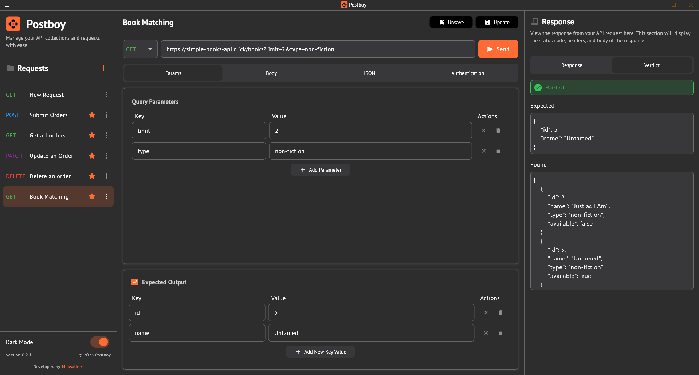

# Postboy

A minimalist, lightweight API testing desktop application built with Flutter. Designed for developers who need a fast, efficient alternative to traditional API testing tools with powerful automation capabilities.

## Overview

Postboy API tester streamlines the API development workflow by providing essential testing features with a focus on speed and simplicity. No account creation, no cloud dependencies—just pure, local API testing power.

## Key Features

### Core Functionality

- **Real-time Header Management**: Add headers using intuitive key-value text fields with instant URL updates
- **Flexible JSON Body Editing**: Write JSON directly or build it using key-value pairs
- **JSON Formatting**: Clean up and format copied JSON with a single click
- **Bearer Token Authentication**: Streamlined JWT token support—the only auth method modern developers need
- **Theme Support**: Switch seamlessly between light and dark themes

### Advanced Capabilities

#### Smart Body Conversion
Convert between key-value pairs and JSON format effortlessly. Build your request body the way that makes sense for your workflow.

#### Expected Output Matching
Validate API responses with precision:
- **Key Matching**: Check if a specific key exists in the response (any value)
- **Key-Value Matching**: Verify exact key-value pairs in the response
- **Multiple Conditions**: Add unlimited key-value pairs for comprehensive validation
- **Perfect for Testing**: Quickly locate specific items in complex response structures

#### No-Code Automation
Run automated API tests without writing a single line of code:
- **Configurable Iterations**: Set custom run counters for stress testing
- **Dynamic Data Generation**:
    - Random value generation with upper and lower bounds
    - Incremental value generation for sequential testing
    - Support for all data types (strings, numbers, booleans, etc.)
- **Parameter Flexibility**: Apply dynamic values to any body parameter

### Privacy & Performance

- **Local Storage**: All requests saved locally—no cloud, no accounts, no hassle
- **Offline Ready**: Test localhost endpoints without internet connectivity
- **Privacy First**: Your API data stays on your machine

## Why Postboy?

Unlike heavyweight alternatives, Postboy focuses on what developers actually use daily:

- ⚡ **Lightning Fast**: No bloat, just essential features
- 🎯 **Developer-Centric**: Built by developers, for developers
- 🔒 **Private & Secure**: Complete offline functionality
- 🤖 **Automation Made Easy**: Visual automation setup without scripting
- 🎨 **Clean Interface**: Minimalist design that stays out of your way

## Getting Started

1. Download the latest release for your platform
2. Launch the application
3. Start testing your APIs immediately—no setup required

## Use Cases

- **Rapid API Development**: Quick endpoint testing during development
- **Response Validation**: Verify API responses match expected structures
- **Load Testing**: Run automated requests to test API performance
- **Sequential Testing**: Test endpoints with incremental data patterns
- **Local Development**: Test localhost APIs without internet dependency

## System Requirements

- Windows, macOS, or Linux
- No internet connection required for localhost testing

## Technology Stack

Built with Flutter for cross-platform compatibility and native performance.

## License

[Will be added soon]

## Contributing

Contributions are welcome! Please feel free to submit issues or pull requests.

## Support

For bug reports or feature requests, please open an issue on the repository.

---

**Built for developers who value simplicity, speed, and privacy.**